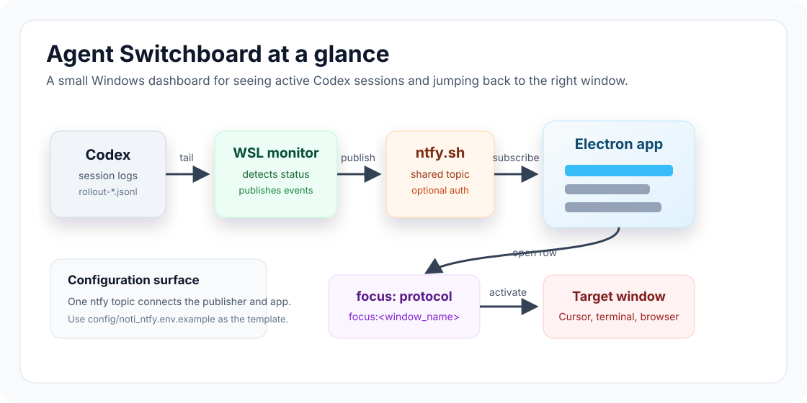

# Agent Switchboard

Agent Switchboard is a Windows notification dashboard for AI-agent workflows. It shows live status updates from Codex sessions, lets you jump back to the relevant window through a `focus:` URL protocol, and uses ntfy as the message bus.



The current stack is:

```text
Codex session logs -> codex_session_monitor -> ntfy -> Electron app -> focus: protocol -> target window
```

## What Is Included

- `noti_app_electron/` - the current Electron dashboard.
- `codex_session_monitor/` - a WSL-side Codex session log monitor and ntfy publisher.
- `focus-protocol/` - a Windows `focus:` URL protocol handler implemented in C#.
- `scripts/` - helper scripts for managing the Electron app and Startup folder entries from WSL.
- `noti_app/` - the older Python/Tkinter dashboard, kept for reference.
- `config/noti_ntfy.env.example` - ntfy configuration template. Do not commit real credentials.

## Requirements

- Windows 10/11.
- WSL for the Codex session monitor.
- Node.js/npm for the Electron app.
- Auto-start and window focusing use normal per-user Windows APIs; admin is not required for the Startup folder entry.

## Configure ntfy

Create a unique ntfy topic and configure both the Windows app and WSL publisher with the same values.

```bash
cp config/noti_ntfy.env.example ~/.config/noti_ntfy.env
```

For the Electron runtime, copy the same edited file to:

```text
C:\noti_app_electron\noti_ntfy.env
```

The config supports:

```text
NTFY_SERVER=https://ntfy.sh
NTFY_TOPIC=agent_switchboard_demo_topic_change_me
NTFY_TOKEN=
NTFY_USERNAME=
NTFY_PASSWORD=
NTFY_AUTH_HEADER=
NOTI_HOST_ID=
```

If your topic is public, auth can be empty. For protected topics, set either `NTFY_TOKEN`, `NTFY_USERNAME`/`NTFY_PASSWORD`, or `NTFY_AUTH_HEADER`.

## Electron App

Install dependencies and run from `noti_app_electron/`:

```bash
npm install
npm start
```

For Tom's Windows runtime layout, the app runs from:

```text
C:\noti_app_electron
```

The launcher reads `C:\noti_app_electron\noti_ntfy.env` and starts:

```text
C:\noti_app_electron\node_modules\electron\dist\electron.exe C:\noti_app_electron\main.js
```

Useful WSL helpers:

```bash
bash scripts/noti_app_electron.sh restart
bash scripts/noti_app_electron.sh status
```

## Codex Session Monitor

Run from WSL:

```bash
cd codex_session_monitor
./codex_session_monitor.sh restart
./codex_session_monitor.sh status
./codex_session_monitor.sh logs
```

The monitor scans:

```text
~/.codex/sessions/**/rollout-*.jsonl
```

It publishes status messages like:

```text
window_name | thread_name - function_call_output
window_name | thread_name - task_complete
```

The Electron app parses those messages, updates its local database, and displays current session state.

## focus: Protocol

Install the protocol handler from PowerShell:

```powershell
cd focus-protocol
.\install-focus-protocol-exe.ps1
```

This registers:

```text
focus:<window_name>
```

to launch `FocusWindow.exe`, which matches the target against window title/process rules in `focus-protocol/match-rules.json`.

The Electron app uses this protocol when you press Enter on a selected row or use the configured focus hotkey.

## Startup

To add the Electron app to the current user's Windows Startup folder:

```bash
bash scripts/windows_startup_folder.sh add \
  --name "Noti App Electron" \
  --target 'C:\noti_app_electron\launch_noti.bat' \
  --working-dir 'C:\noti_app_electron'
```

Inspect it:

```bash
bash scripts/windows_startup_folder.sh status --name "Noti App Electron"
```

For the WSL-side Codex monitor, prefer a Windows Scheduled Task or a Startup shortcut that launches `wsl.exe` explicitly. Do not rely on interactive shell aliases for daemon startup.

## Security

- Never commit `noti_ntfy.env`, `.env`, tokens, passwords, or private ntfy topics.
- `config/noti_ntfy.env.example` is intentionally safe to commit.
- The default topic in source is a placeholder and should be changed before real use.

## License

MIT License - see [LICENSE](LICENSE).
